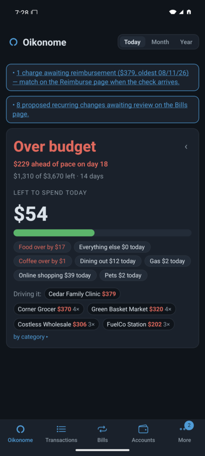
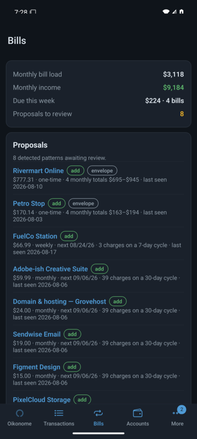
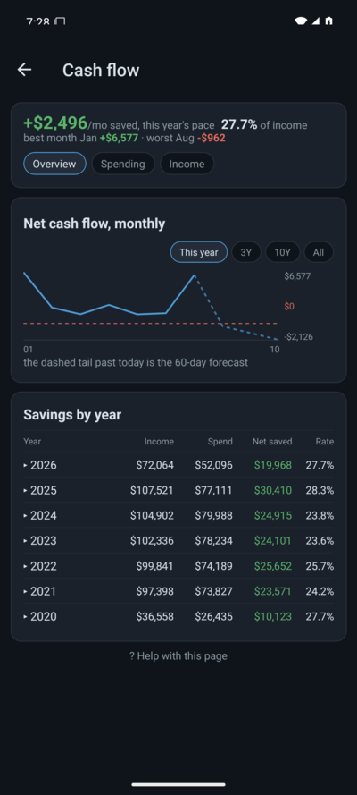
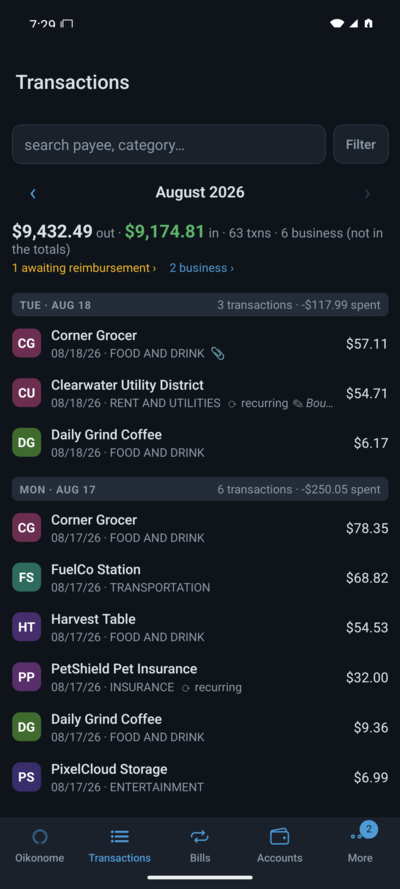
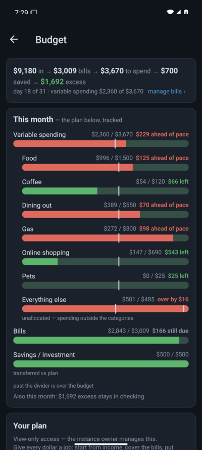

<p align="center">
  
</p>

<h1 align="center">Oikonome</h1>

<p align="center">
  <b>Self-hosted personal &amp; family finance that emails you one honest answer every morning: are you on budget today?</b>
</p>

<p align="center">
  
  
  
  
  <a href="https://oikonome.com/donate"></a>
</p>

<p align="center">
  <a href="docs/quickstart.md">Quick start</a> ·
  <a href="docs/">Documentation</a> ·
  <a href="https://demo.oikonome.com">Live demo</a> ·
  <a href="#features">Features</a> ·
  <a href="#security--privacy">Security</a> ·
  <a href="CONTRIBUTING.md">Contributing</a> ·
  <a href="https://oikonome.com">oikonome.com</a>
</p>

---

> [!WARNING]
> **Oikonome is young and under active development.** Expect bugs and
> breaking changes between releases. It is a budgeting tool, **not a
> system of record** — keep your own financial records, and never treat it as
> the only copy of your data. Provided without warranty (see [LICENSE](LICENSE.md)).

This repository is the **self-hostable product** — every feature, on your
own hardware, forever. A hosted service run by the maintainer exists at
[oikonome.com](https://oikonome.com) for people who would rather not run it
themselves. To use the mobile app against your own instance, build it
yourself (see [specs/mobile.md](specs/mobile.md)).

## Documentation

Full setup, importing, reverse-proxy, master-key, and troubleshooting guides
live in **[docs/](docs/)**. New here? Start with the
**[quick start](docs/quickstart.md)** — a self-host instance in about five
minutes.

## Try the live demo

**[demo.oikonome.com](https://demo.oikonome.com)** runs the real app, no
install required. The sign-in screen has **credentials pre-filled** — just
continue. Everything you see is **synthetic sample data**, and the whole
instance **resets to a clean state every hour**, so click around freely.

## Why Oikonome

Most finance apps want you to *open them*. Oikonome is built the opposite way —
around a single daily email, so the tool does the checking, not you.

- **The daily verdict email is the product.** One plain message each morning:
  on budget, over, or under — plus the single number to hit today, a cash-flow
  forecast, and the *why* when you're over. No dashboard habit required.
- **Your data, your hardware.** It runs on a box you own. No ads, no data
  selling, no telemetry, no lock-in — and categorization happens on-box via a
  bundled local LLM, so nothing about your finances leaves your server.
- **Bring your data your way.** Live feeds via Plaid, MX, or SimpleFIN (your
  own keys), community API scripts, or plain-file imports — all de-duplicated,
  idempotent, and one-click reversible.
- **Multi-source and resilient.** Link two sources to one real account: the
  healthiest live source serves the data and the rest stand by as automatic
  backups, so a flaky aggregator never leaves you blind or double-counts.

## Features

| Capability |
|---|
| Daily budget verdict email (on / over / under + today's number) |
| 60-day cash-flow forecast with card-payoff scenarios |
| Cash Flow report — flow picture, saved-by-month with a 60-day forecast tail, spending & income breakdowns with income by source |
| Automatic recurring-bill detection with evidence + approve/reject |
| Envelope budgets — monthly **and** lumpy annual pools |
| Retirement projection via historical market replay |
| Bank sync — Plaid · MX · SimpleFIN, on your own keys |
| File imports — CSV · OFX/QFX · Quicken QIF · Mint · YNAB · PDF |
| Multi-source accounts with automatic failover |
| Receipt & check image parsing (vision line-items) |
| Local-LLM categorization — data never leaves the box |
| Net worth over time |
| Merchant identity you control — logos, chain outlets under their brand, rename, merge spelling variants, undo |
| Transaction provenance — check number, payment channel, location, line of business, and *why* a row has its category |
| Ask-your-ledger assistant — read-only summaries, answered by the on-box model |
| Business / self-employed tracking — entities, P&L, Schedule C, mileage, estimated tax |
| Household logins — view-only members with their own second factor and email preferences |
| Passkeys / TOTP 2FA, per-tenant encryption at rest |
| Email, SMS (your own Twilio credentials) and push delivery of the summaries |
| One-command manager (install / backup / restore / upgrade) |
| Native iOS and Android app — source in `mobile/`, built pinned to your own server |

<sub>Nothing here is gated: a self-hosted instance has every feature, with
no tiers and no license checks.</sub>

## Security & privacy

A finance app earns trust by keeping your data on your own machine and hard to
reach even if that machine is breached.

- **Self-hosted, zero telemetry.** Nothing about your finances leaves your
  server. No analytics beacon, no phone-home.
- **On-box categorization.** Transaction text is classified by a bundled local
  LLM — it is never shipped to an external AI provider.
- **Nothing loads from a third party.** Merchant logos are fetched once by your
  instance, cached there, and served from it, so a page full of logos tells the
  aggregator nothing about when you looked at your ledger — and the daily email
  fetches nothing from the web: its chart and the brand mark travel inside the
  message itself, so opening it cannot be tracked.
- **Envelope-encrypted secrets.** Aggregator tokens and API keys are sealed
  with a **per-tenant envelope** under a master key you control (see
  [docs/master-key.md](docs/master-key.md)); a raw database dump reveals no
  usable credentials.
- **Tenant isolation enforced by Postgres RLS.** Every domain table carries
  row-level security keyed to the tenant, so isolation is enforced at the
  database — not just in application code — and the test suite verifies it on
  every run.
- **Strong auth.** Argon2id password hashing, TOTP 2FA, and passkeys/WebAuthn.
  A password reset alone can never strip a second factor: losing the password,
  the authenticator *and* the recovery codes at once takes either a seven-day
  cooling-off recovery that the account can cancel from any channel, or an
  operator who has checked who is asking.
- **You own the keys and the exits.** Bank connections use *your* Plaid / MX /
  SimpleFIN credentials, and you can export or delete everything at any time.

Found a vulnerability? Please report it privately — see
[SECURITY.md](SECURITY.md) (security@oikonome.com), 48-hour response
commitment.

## Quick start

```bash
git clone https://github.com/oikonome/oikonome.git && cd oikonome
./oikonome.sh install
```

`./oikonome.sh` is the single entry point — `install`, `upgrade`, `status`,
`logs`, `backup`, `restore`, `reset`, `uninstall`. Everything (code, config,
database) lives in one folder; add automatic-certificate TLS with
`./oikonome.sh https <domain>`. The installer runs a guided setup wizard on
first boot.

Requires a container runtime (Docker or Podman) with Compose. The local LLM
for categorization is bundled — no external AI account needed. Full walkthrough
in the **[quick start guide](docs/quickstart.md)**.

## Tech stack

- **Server** — Python / FastAPI, PostgreSQL 18 with **row-level-security**
  multi-tenancy, psycopg 3 (plain SQL, no ORM), arq + Redis for background jobs
  (hourly sync, nightly detection, the morning email sweep).
- **Web** — React + Vite + TypeScript SPA, served by FastAPI at `/app`.
- **Categorization** — a bundled local LLM classifies transactions on-box.
  Optionally add your own AI backends (local or cloud, any OpenAI-compatible
  endpoint) under Settings → AI and route each task — assistant,
  categorization, receipts — to a different one.
- **Packaging** — Docker / Podman Compose, one folder, one manager script;
  Caddy provides automatic-certificate TLS.

See [CLAUDE.md](CLAUDE.md) and [DEVELOPMENT.md](DEVELOPMENT.md) for the fuller
architecture and how to run the test suite — a comprehensive `unittest` suite
(no pytest dependency; `make test` runs it) that exercises every feature
against a real Postgres and doubles as a continuous check of tenant
isolation.

## Running it for other people

One instance normally holds one household. `OIKONOME_HOSTED=1` switches it
to the shape an operator running it for others needs — accounts arrive by
invite instead of the setup wizard, a second factor is mandatory, the
operator console is passkey-only, and the operator's own mail account sends
the household mail. See [docs/deployment-modes.md](docs/deployment-modes.md),
and [DEVELOPMENT.md](DEVELOPMENT.md) → *Extension points* for the entry
points an operator's own add-on package registers through.

## Screenshots

All data shown is synthetic. For a hands-on look, the
**[live demo](https://demo.oikonome.com)** is the same build with a
seeded household.

| Today | Bills | Cash flow |
|---|---|---|
|  |  |  |

| Transactions | Budget |
|---|---|
|  |  |

## Contributing

Contributions are welcome — see [CONTRIBUTING.md](CONTRIBUTING.md). File bugs
as [Issues](https://github.com/oikonome/oikonome/issues) (attach the
diagnostic bundle from the in-app **/doctor** page). Questions, setup help,
ideas and show-and-tell live in
[Discussions](https://github.com/oikonome/oikonome/discussions); anything
about a hosted account goes privately to
[oikonome.com/support](https://oikonome.com/support). Each release is
announced under [Releases](https://github.com/oikonome/oikonome/releases).
From inside a running instance, the **💬 Feedback & bug reports** tab does the
same job in one step — pick *Report a bug*, say what happened, what you
expected and where, and it packages the health bundle with it.

## Support the project

Self-hosting is free forever and always will be — no feature gates, no
telemetry, nothing held back. If it's useful to you and you'd like to help
keep it that way, **[oikonome.com/donate](https://oikonome.com/donate)** takes
one-time gifts (pick your amount) or a small monthly amount.

Donations are not required for anything and buy no features.

## Contributors

Development happens in a private repository and each release is published
here as a single reviewed commit, so the contributors graph will only ever
show the maintainer. Accepted contributions are credited in the release
commit that ships them — see [CONTRIBUTING.md](CONTRIBUTING.md) and
[HISTORY.md](HISTORY.md).

## License

[FSL-1.1-ALv2](LICENSE.md) (Functional Source License): use, modify, and
self-host freely; each release converts to Apache-2.0 two years after
publication. The only excluded use is running a competing hosted service.
</content>
